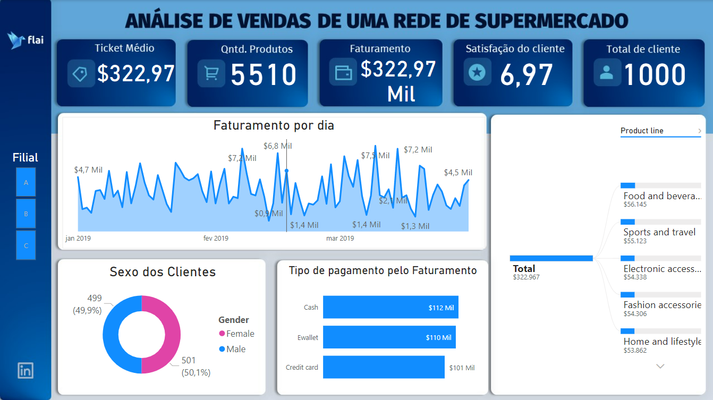

# Projeto: Análise de Vendas 

## Introdução do problema
Fazer a gestão de faturamento é necessária para manter uma empresa funcionando. Conhecer a receita bruta, nível de satisfação, funcionamento de cada setor, produto (categoria) que mais vende são algumas métricas necessárias para uma boa gestão da empresa.

**Problema:** Melhorar as vendas de uma rede de supermercados

**Objetivo:** Fazer uma análise de vendas de uma rede de supermercados que tem três lojas e forneceu dados durante três meses. Conhecer a receita bruta de cada unidade da empresa e não só do total, qual é a satisfação dos clientes, como está o funcionamento de cada setor do mercado, qual é o produto que vende mais, qual é o ticket médio, quantos clientes tem, qual é o dia que vende mais, qual o tipo de pagamento mais usado.

**Dataset:** O conjunto de dados é um dos históricos de vendas da empresa de supermercados que registrou dados em 3 filiais diferentes (identificadas por A, B e C) por 3 meses. Dados foram extraídos do Kaggle (https://www.kaggle.com/datasets/aungpyaeap/supermarket-sales).

**Ferramenta:** Power BI na criação do dashboard e o tratamento dos dados (ETL) no Power Query Editor.

**Resultados:** Para este problema da análise de vendas de uma rede de supermercado foram analisadas as seguintes variáveis: ticket médio por cliente, quantidade de produtos vendidos, faturamento total, satisfação do cliente, quantidade de clientes, faturamento diário, sexo dos clientes, tipo de pagamento e análise de categorias de produtos vendidos na rede. As variáveis foram analisadas em cada filial A, B e C do supermercado.

O ticket médio da rede é de $322,97, tendo uma quantidade igual a 5510 produtos vendidos nos três meses com um faturamento de $322,97 mil doláres. A satisfação dos 1000 clientes é de 6,97. O setor que traz mais faturamento é a categoria de comidas e bebidas. O dia que mais teve vendas foi 7 de fevereiro, o tipo de pagamento mais usado nas compras é dinheiro e na distribuição do perfil de clientes de modo geral há aproximadamente o mesmo número de clientes masculino e feminino.

Ao analisar os dados por filial da rede de supermercado observa-se:

- Loja A: tem ticket médio de $312,35, uma quantidade de 1859 produtos vendidos, com um faturamento de $106,20 mil doláres. A satisfação dos 340 clientes é de 7,03. O setor de Casa, Eletrodoméstico e Decoração teve um maior faturamento, o tipo de pagamento mais usado é e-wallet (carteira digital). Em relação ao gênero tem um pouco mais do sexo masculino do que feminino.

- Loja B: tem ticket médio de $319,87, uma quantidade de 1820 produtos vendidos, com um faturamento de $106,20 mil doláres. A satisfação dos 332 clientes é de 6,82. O setor de Esporte e viagem teve um maior faturamento, o tipo de pagamento mais usado é o cartão de crédito. Em relação ao gênero tem um pouco mais do sexo masculino do que feminino.

- Loja C: tem ticket médio de $337,10, uma quantidade de 1831 produtos vendidos, com um faturamento de $110,57 mil doláres. A satisfação dos 328 clientes é de 7,07. O setor de Comida e bebidas teve um maior faturamento, o tipo de pagamento mais usado é o dinheiro. Em relação ao gênero tem mais cliente do sexo feminino do que masculino.

Nota-se que a loja C é a filial que possui o maior ticket médio, o maior faturamento e também a maior satisfação dos clientes. A loja A teve uma maior quantidade de produtos vendidos e possui uma quantidade um pouco maior de clientes do que as lojas B e C. Em relação ao perfil dos clientes a loja C apresenta um maior número de clientes do sexo feminino enquanto que nas lojas A e B são clientes do sexo masculino. A loja B por sua vez teve o menor número de produtos vendidos, e a menor satisfação dos clientes.

**Conclusão:** A partir dessa análise os resultados mostram que a rede de supermercados pode implementar melhorias nas lojas A e B para que a satisfação dos clientes aumente e se aproxime da loja C.

Para maiores informações acesse: https://app.powerbi.com/view?r=eyJrIjoiZmVjMTI5MTItMTlkNi00NmZiLWIzMjItZjZmYmIwMGRhZWYzIiwidCI6IjY1OWNlMmI4LTA3MTQtNDE5OC04YzM4LWRjOWI2MGFhYmI1NyJ9&pageName=ReportSection

Projeto desenvolvido no curso "Data Insights" do Programa Dominando Data Science 3.0 oferecido pela FLAI - Inteligência Artificial e Data Science. 

